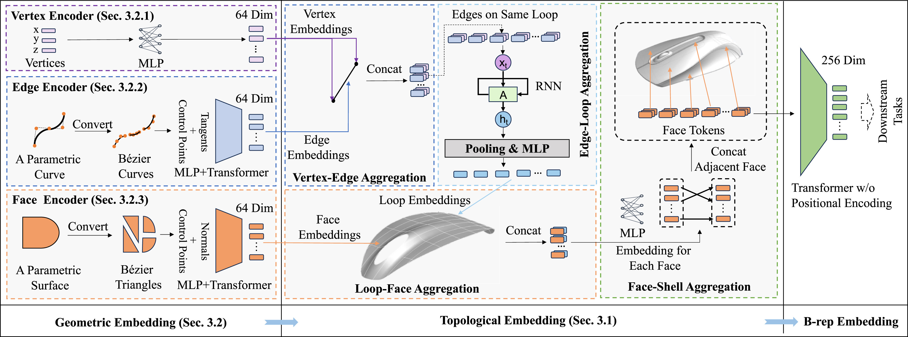

# BRT: Boundary Representation Learning via Transformer

- By Lizhen Zhu and Qiang Zou
- Email: qzou.code@gmail.com
- Webpage: https://qiang-zou.github.io/
- Latest Release: 2025.09.07

 
<br />

## !important
The source code was developed as a byproduct of the projects and methods presented in [1,2]. It promotes a new learning method for boundary representation (B-rep) models. This may be the first work using the Transformer architecture (not just attention-enhanced GNN) to learn and understand B-rep models. Additionally, it differs from existing methods in that it operates entirely in the continuous domain, without discretizing the models. Previous methods are consistently based on the discretization of B-rep surface patches into points, meshes, or voxels, which inevitably introduce errors. It achieves SOTA performance in part classification and feature recognition tasks.

It can be run with Pytorch 2.0.1 + CUDA 11.8 on the operating system Ubuntu 22.04 LTS. Windows, Mac.


1.Copyright
-----------

- BRT is GNU licensed. It is developed and maintained by Lizhe Zhu and Qiang Zou for research use. All rights of the program are reserved by Qiang Zou. This Python source code is available only for primary use for academic purposes. No secondary use, such as copy, distribution, diversion, business purpose, etc., is allowed. In no event shall the author be liable to any party for direct, indirect, special, incidental, or consequential damage arising out of the use of this program. BRT is self-contained.


2.Download
----------

- The source code can be downloaded from: [https://github.com/Qiang-Zou/BRT](https://github.com/Qiang-Zou/BRT)
- The TMCAD dataset can be downloaded from: [https://pan.zju.edu.cn/share/933cffb707d4c8b069dbf4c85f](https://pan.zju.edu.cn/share/933cffb707d4c8b069dbf4c85f)

3.Installing (Windows/Linux/Mac + Pytorch 2.2.1 + CUDA 12.1)
-------------------------------------------

- Environment setup

    ```shell
    conda env create -f environment.yml
    conda activate brt
    ```

4.Usage
-------

- To preprocess the dataset like TMCAD (Truly Mechanical CAD Dataset), run

    ```shell
    cd process
    # extract topology
    python gen_tmcad_topo.py /path/to/input_dir /path/to/output_dir/of/topology
    # extract face geometry
    python gen_tmcad_triangles.py /path/to/input_dir /path/to/output_dir/of/triangles
    # split the dataset and save the result in /path/to/dataset/dir/datasplit.json
    python split_dataset.py /path/to/output_dir/of/triangles /path/to/output_dir/of/topology  /path/to/dataset/dir/datasplit.json
    ```

- You can then train the model by the following command 

    ```shell
    # classification
    python classification.py train --num_classes num_of_classes --dataset_dir /path/to/dataset/dir --batch_size 16 --num_workers 4
    # segmentation
    python segmentation.py train --num_classes num_of_classes --dataset_dir /path/to/dataset/dir --batch_size 16 --num_workers 4
    ```

- You can test the model by the following command 

    ```shell
    # classification
    python classification.py test --num_classes num_of_classes --dataset_dir /path/to/dataset/dir --batch_size 16 --num_workers 4 --checkpoint path/to/checkpoint
    # segmentation
    python segmentation.py test  --num_classes num_of_classes --dataset_dir /path/to/dataset/dir --batch_size 16 --num_workers 4 --checkpoint path/to/checkpoint
    ```

5.References
-------------
- [1] Qiang Zou, Lizhen Zhu, "Bringing Attention to CAD: Boundary Representation Learning via Transformer." Computer-Aided Design, vol.189, 103940, 2025. https://doi.org/10.1016/j.cad.2025.103940
- [2] Qiang Zou , Yincai Wu , Zhenyu Liu , Weiwei Xu , Shuming Gao. "Intelligent CAD 2.0." Visual Informatics (2024). https://doi.org/10.1016/j.visinf.2024.10.001
